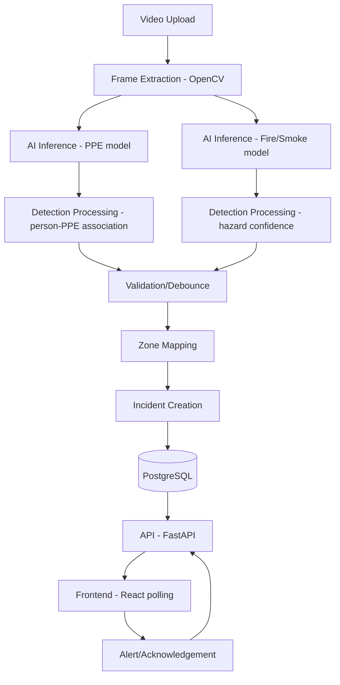
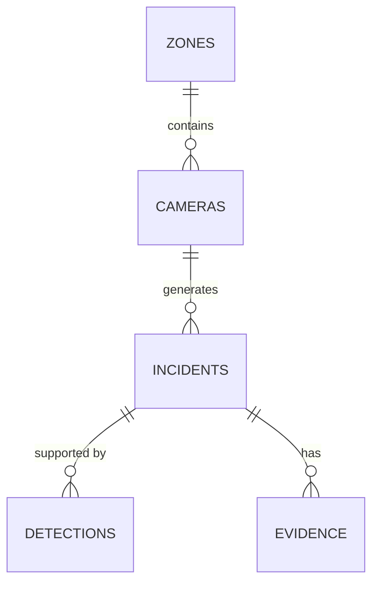

# 02 — SYSTEM DESIGN (MVP)
### SentinelView — PS06 PPE/Fire Compliance Detection

**Source note:** Derived only from the Main Hackathon Blueprint (see Source of Truth). Where the missing PRD/Resources/Design files would normally supply detail, this is marked **[VERIFY]** or **[OPEN]**.

---

## ⚠️ CONFLICT FLAGGED (Rule 11)

The Blueprint's Version 3 (§34) makes **3-camera concurrent processing a P0 feature** for competitive differentiation. The current instructions for this MVP explicitly list **"complex multi-camera orchestration"** as something that must **NOT** automatically enter MVP scope unless explicitly required.

**Resolution:** This document resolves the conflict in favor of the more specific, more recent instruction — **MVP = single video/stream input.** Multi-camera concurrency is moved to **LATER** (post-MVP competitive hardening), consistent with "WORKING > COMPLETE > RELIABLE > POLISHED > OPTIMIZED." This does not discard the Blueprint's multi-camera design — it is preserved as a documented future phase, not deleted.

---

## A. Product Scope

### What MVP does
- Accepts **one uploaded video file** (pre-recorded clip, not live CCTV integration) via an Upload/Demo screen.
- Runs it through PPE detection + fire/smoke detection.
- Applies a simple debounce rule before creating an incident.
- Attaches a **zone label** to the incident (zone is manually pre-configured/seeded, not dynamically discovered).
- Stores the incident + a snapshot image as evidence.
- Displays incidents on a dashboard, in near-real-time (polling, not WebSocket — see §D).
- Lets a user acknowledge an incident.

### What MVP does NOT do
- No live CCTV/RTSP ingestion (upload-only).
- No multi-camera concurrent processing (single stream at a time).
- No WhatsApp/SMS notifications (dashboard-only alerting).
- No analytics/trend charts.
- No role-based multi-user admin (single default user is acceptable).
- No ONNX export/optimization (native `ultralytics` inference is sufficient for MVP).
- No own-footage validation gating the golden path (it runs in parallel, doesn't block M4).

### Exact Golden Path
```
Video Upload → Frame Extraction → AI Inference (PPE + Fire) →
Detection Processing → Validation/Debounce → Zone Mapping →
Incident Creation → Database → API → Frontend Dashboard → Acknowledgement
```

### User Journey (MVP)
1. User opens Upload/Demo screen.
2. Uploads a video file.
3. Sees a processing/loading state.
4. Once processing completes, is shown (or navigated to) the Dashboard with the new incident(s) visible.
5. Clicks an incident to see detail: zone, type, confidence, snapshot.
6. Clicks "Acknowledge."

### Core Screens (MVP)
1. **Upload/Demo screen** — primary golden-path entry point.
2. **Dashboard** — incident list/feed (polling-refreshed).
3. **Incident Detail** — zone, type, confidence, snapshot, acknowledge button.
4. *(Minimal, read-only)* **Zone/Camera list** — seeded data, not a full admin CRUD UI for MVP.

---

## B. Architecture



**Component definitions:**

| Component | Responsibility | MVP Implementation |
|---|---|---|
| Frame Extraction | Sample frames from uploaded video at a fixed rate | OpenCV, 2 FPS sampling **[DECISION — MVP simplification of Blueprint's 2–5 FPS range, fixed at low end for CPU headroom]** |
| AI Inference | Run PPE and fire/smoke models on each sampled frame | In-process Python function call using `ultralytics` — **not** a separate microservice (see §C) |
| Detection Processing | Convert raw model output into structured detections; run person↔PPE bbox association | Pure Python logic in the backend's ML wrapper module |
| Validation/Debounce | Suppress single-frame false positives | Require the same signal in **2 of the last 3 sampled frames** for a given (zone, incident_type) before creating an incident **[DECISION — MVP simplification of Blueprint's "3 of 5"]** |
| Zone Mapping | Attach a human-readable zone to the incident | Camera→Zone is a **static seeded mapping** in the DB for MVP, not dynamic camera discovery |
| Incident Creation | Persist a new incident record + snapshot | Backend service, single DB transaction |
| Database | Store cameras, zones, incidents, detections, evidence | PostgreSQL |
| API | Expose incidents/cameras/zones to frontend | FastAPI REST endpoints (see §D) |
| Frontend | Display incidents, allow acknowledgement | React, polling `/incidents` every few seconds **[DECISION — WebSocket deferred to LATER]** |
| Alert/Acknowledgement | Let a user mark an incident as handled | `POST /incidents/{id}/ack` |

---

## C. AI/ML

**Model choice (from Blueprint, unchanged):**
- PPE: YOLOv8n/YOLO11n fine-tuned on Construction-PPE.
- Fire/Smoke: MVP uses the **pretrained baseline weights** from the gengyanlei or luminous0219 repo directly (no fine-tuning required to reach a working golden path) **[DECISION — MVP simplification]**. Fine-tuning on FireAndSmoke is a SHOULD/LATER accuracy improvement, not an MVP blocker.

**Input/output format:**
- Input: a single frame (numpy array / JPEG bytes) from the extraction step.
- Output per model call: list of `{class_name, bbox: [x1,y1,x2,y2], confidence}`.

**Confidence handling:** discard any detection below `confidence < 0.5` **[DECISION — placeholder threshold, to be tuned once real test data exists; matches Blueprint's guardrail description]**.

**Person-PPE association:** for each detected `person` bbox, check whether a required PPE-item bbox (helmet/vest/boots/gloves) center-point falls within the person bbox. Person with no required item's center inside their box in a frame → flagged non-compliant for that item in that frame **[FACT — Blueprint, "Person↔PPE association... bounding-box overlap"]**.

**Detection filtering:** confidence threshold (above) + person-in-frame gating (don't evaluate PPE compliance on frames with zero detected persons).

**Temporal debounce:** see Detection Processing row above — 2-of-3 sampled-frame rule for MVP.

**Inference flow:**
1. Backend receives uploaded video → saves to a temp path.
2. Backend triggers a background task (FastAPI `BackgroundTasks` for MVP — **not** Celery/Redis queue, that's LATER) that:
   a. Extracts frames via OpenCV.
   b. Calls the PPE model wrapper and fire/smoke model wrapper on each sampled frame.
   c. Runs association/filtering/debounce logic.
   d. For each debounced-confirmed signal, calls the Incident service to create a DB record + save a snapshot.
3. Frontend polls `/incidents` and sees new rows appear once processing completes each one.

**Where model files live:** `ml/ppe_model/weights/best.pt`, `ml/fire_model/weights/<pretrained_baseline>.pt` (see repo structure, §G).

**How backend calls inference:** a thin Python wrapper module (`backend/services/inference.py`) loads both models **once at app startup** (not per-request) and exposes `run_ppe(frame)` / `run_fire(frame)` functions returning the structured detection list above.

**How results become incidents:** Detection Processing → Validation/Debounce → Zone Mapping → a single `Incident` row is created only after debounce confirms a signal, with `confidence` set to the average confidence of the confirming frames and `severity` derived from that average per the fixed rule in §E. Each confirming frame's `class_name`/`confidence`/`bbox` is also written to the `detections` table (§E) as supporting evidence for the decision.

---

## D. Backend

**FastAPI structure:**
```
backend/
├── main.py                # app entrypoint, model loading at startup
├── config.py               # pydantic Settings, reads .env
├── routers/
│   ├── auth.py              # [MVP: minimal, single default user — VERIFY if even needed for MVP]
│   ├── cameras.py           # read seeded cameras/zones
│   ├── incidents.py         # list/detail/acknowledge
│   └── demo.py               # upload + processing status
├── services/
│   ├── inference.py          # model wrappers (see §C)
│   ├── detection_processing.py  # association, filtering
│   ├── debounce.py           # temporal validation logic
│   ├── zone_mapping.py       # camera→zone lookup
│   └── incident_service.py    # create/list/ack incidents
├── schemas/                 # pydantic request/response models
├── models/                  # SQLAlchemy ORM models
├── db.py                     # SQLAlchemy engine/session
└── requirements.txt
```

**Background processing:** FastAPI `BackgroundTasks` for MVP. **[DECISION — MVP simplification]**: Blueprint's Redis pub/sub real-time push is deferred; Redis itself is **not required for MVP** since polling replaces WebSocket push. Re-introduce Redis when WebSocket is added post-MVP.

**Error handling:** every router wraps DB/inference calls in try/except → returns FastAPI `HTTPException` with a clear status code; inference failures on a frame are logged and skipped, never crash the background task.

**Configuration / env vars:**
| Variable | Purpose |
|---|---|
| `DATABASE_URL` | PostgreSQL connection string |
| `PPE_MODEL_PATH` | path to PPE weights |
| `FIRE_MODEL_PATH` | path to fire/smoke weights |
| `CONFIDENCE_THRESHOLD` | detection confidence cutoff (default 0.5) |
| `UPLOAD_DIR` | where uploaded videos/snapshots are stored |
| `JWT_SECRET` | **[VERIFY — only needed if auth is in MVP scope, see Open Questions]** |

### API Contracts (MVP)

| Method | Path | Input | Output | Purpose | Error Cases |
|---|---|---|---|---|---|
| POST | `/demo/upload` | multipart video file | `{job_id}` | Start processing an uploaded video | 400 invalid file type, 413 too large |
| GET | `/demo/status/{job_id}` | — | `{status: "processing"|"done"|"failed", incident_ids: []}` | Poll processing progress | 404 unknown job_id |
| GET | `/incidents` | query: `zone?`, `type?`, `status?` | `Incident[]` | List incidents for dashboard | 500 DB error |
| GET | `/incidents/{id}` | — | `Incident` (with snapshot URL) | Incident detail view | 404 not found |
| POST | `/incidents/{id}/ack` | — | `Incident` (status updated) | Acknowledge an incident | 404 not found, 409 already acknowledged |
| GET | `/cameras` | — | `Camera[]` (seeded, includes zone) | Populate zone/camera list screen | 500 DB error |

**ML→Backend→Frontend contract (adapted from instructions):**

ML/detection layer output (internal, per debounced signal):
```json
{
  "camera_id": "cam-01",
  "timestamp": "2026-09-09T10:15:00Z",
  "detections": [
    {"class_name": "no_helmet", "confidence": 0.81, "bbox": [120,45,210,160]}
  ]
}
```

Backend converts to a persisted Incident, exposed via API:
```json
{
  "id": "uuid",
  "incident_type": "no_helmet",
  "zone": "Zone A - Assembly Floor",
  "severity": "medium",
  "confidence": 0.81,
  "evidence_url": "/evidence/uuid.jpg",
  "status": "open",
  "detected_at": "2026-09-09T10:15:00Z"
}
```
Frontend consumes only the second (Incident) shape — it never sees raw model output directly.

---

## E. Database (MVP Schema)

| Table | Columns | PK | FK | Notes |
|---|---|---|---|---|
| `users` | id, name, email, password_hash, role | id | — | **[VERIFY — MVP may not need real auth; single seeded user may suffice]** |
| `zones` | id, name, floor_area | id | — | Seeded manually |
| `cameras` | id, zone_id, label, status | id | zone_id → zones.id | Seeded manually; `stream_url` **omitted for MVP** since ingestion is upload-only, not live |
| `incidents` | id, camera_id, incident_type, confidence, severity, status, detected_at | id | camera_id → cameras.id | Index on `detected_at` and `camera_id`. **No `zone` column** — zone is *derived* at query time via `camera.zone_id → zones.name` join, never stored redundantly on the incident row (avoids a stale-copy bug if a camera is ever reassigned to a different zone). The API layer (§D) does this join before returning the `Incident` JSON shape, so the frontend still receives a flat `zone` string. |
| `detections` | id, incident_id, frame_index, **class_name**, confidence, bbox | id | incident_id → incidents.id | **[FIX]** Added `class_name` — the debounce logic (§C) needs to know *which* class (e.g., `no_helmet`, `smoke`) was detected on each contributing frame, not just a bare confidence number. Without this column, the 2-of-3 rule has nothing to count against. |
| `evidence` | id, incident_id, image_path | id | incident_id → incidents.id | Snapshot; MVP stores local file path, not cloud object storage |

**Explicitly not created for MVP:** `incident_ack` as a separate table — for MVP, acknowledgement is just a `status`/`acked_by`/`acked_at` set of columns directly on `incidents` (simpler than a join table). **[DECISION — simplest implementation that satisfies MVP requirement, per Rule 13]**

**Severity rule (previously undefined — fixed):** `severity` is set by a simple fixed rule at incident-creation time, not a separate model: **[DECISION — MVP placeholder]** `confidence ≥ 0.75 → "high"`, `0.5–0.75 → "medium"`, `< 0.5 → not created` (filtered out before debounce even runs, per §C's confidence threshold). This is a placeholder rule, not a validated one — **[OPEN]** whether severity should instead depend on incident_type (e.g., fire always "high" regardless of confidence) is a team decision, not something the source files specify.



---

## F. Frontend

| Page | Route | Components | State | API | UX States |
|---|---|---|---|---|---|
| Upload/Demo | `/upload` | FileInput, ProcessingStatus | `jobId`, `status` | `POST /demo/upload`, poll `GET /demo/status/{job_id}` | loading (processing spinner), error (invalid file) |
| Dashboard | `/` | IncidentList, IncidentCard | `incidents[]` (polled every ~3s) | `GET /incidents` | empty ("no incidents yet"), loading, error (API down) |
| Incident Detail | `/incidents/:id` | SnapshotView, AckButton | `incident` | `GET /incidents/{id}`, `POST /incidents/{id}/ack` | loading, error (404), already-acknowledged state |
| Zone/Camera list | `/cameras` | CameraTable (read-only) | `cameras[]` | `GET /cameras` | empty, loading |

**Acknowledgement flow:** click Ack on Incident Detail → optimistic UI update → `POST /incidents/{id}/ack` → on failure, revert UI state and show an error toast.

**Upload/demo flow:** select file → POST → receive `job_id` → poll status every ~2s → on `done`, show a "View Results" link to the Dashboard filtered by the new incident IDs.

---

## G. Repository Structure

```
sentinelview/
├── frontend/           # React + TypeScript app (§F)
├── backend/             # FastAPI app (§D)
├── ml/
│   ├── ppe_model/
│   │   └── weights/       # best.pt (fine-tuned on Construction-PPE)
│   └── fire_model/
│       └── weights/       # pretrained baseline weights (gengyanlei/luminous0219)
├── data/                 # downloaded datasets (not committed — .gitignore)
├── docs/                  # this document, PRD, resources, playbook
├── scripts/               # setup.sh, seed_db.py, download_datasets.py
└── README.md
```

**Purpose of each top-level dir:**
- `frontend/` — the dashboard UI, isolated so it can be developed against mocked API responses.
- `backend/` — API + DB + inference orchestration (does not include model training code).
- `ml/` — model weights and any training/fine-tuning scripts, kept separate from `backend/` so ML work doesn't block backend development.
- `data/` — raw/downloaded datasets, gitignored (too large to commit).
- `docs/` — all four markdown planning documents, kept with the code they describe.
- `scripts/` — one-command setup and DB seeding, critical for the "runs from clean setup" Definition of Done.

---

## Source of Truth
- Main Hackathon Blueprint (`PS06_Final_Master_Hackathon_Blueprint.md`) — only source used.

## Open Questions
- **[OPEN]** Is authentication actually required for the MVP demo, or can a single default/seeded user be used without login? Blueprint assumed JWT auth broadly; MVP-first principle suggests this may be deferrable.
- **[OPEN]** Exact debounce parameters (2-of-3 here is an MVP simplification of the Blueprint's "3 of 5" — needs team agreement).
- **[OPEN]** Confidence threshold (0.5) is a placeholder — no validated value exists yet (see 01_INFORMATION_RESOURCES.md).
- **[OPEN]** Whether `evidence` snapshots need any redaction/privacy handling before demo — not addressed in source files.
- **[OPEN]** Severity rule (§E) is a placeholder fixed-threshold rule — whether incident_type should override confidence-based severity (e.g., any fire detection = "high" regardless of confidence) needs a team decision.

## MVP Boundary
This document defines the **single-video-upload, single-stream, polling-based** system. It explicitly excludes (moved to LATER): live CCTV/RTSP ingestion, multi-camera concurrent processing, WebSocket push, Redis pub/sub, ONNX export, notification integrations (WhatsApp/email/SMS), analytics dashboard, and role-based admin. These are preserved in the Blueprint for post-MVP work, not discarded.
